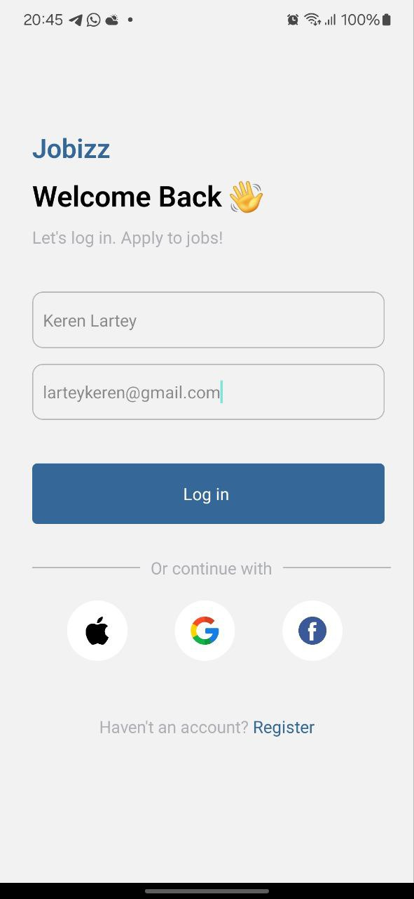

## Overview
    The Job Listing App is a React Native application designed to display job listings in a user-friendly interface. It features a search bar, a list of featured jobs, and a list of popular jobs. The app provides a clean and intuitive UI to help users find job opportunities easily.

## Components
## Login Screen
    Usage: The first page of the app displays a textinput to take in the user name and email and passes it to the homescreen via routes param
    Props: 
    name
    email
## HomeScreen
    Usage: The main screen of the app that displays the user's profile information, a search bar, a list of featured jobs, and a list of popular jobs.
    Props:
    name: The name of the user (passed via route params).
    email: The email of the user (passed via route params).
## JobCard
    Usage: Displays individual job details for featured jobs.
    Props:
    job: The job title.
    company: The name of the company offering the job.
    salary: The salary for the job.
    backgroundColor: The background color of the card.
    logo: The logo of the company.
    location: The location of the job.
## PopularJobCards
    Usage: Displays individual job details for popular jobs.
    Props:
    job: The job title.
    company: The name of the company offering the job.
    salary: The salary for the job.
    location: The location of the job.
    logo: The logo of the company.

## Screenshots
## Login Page

## Home Screen

